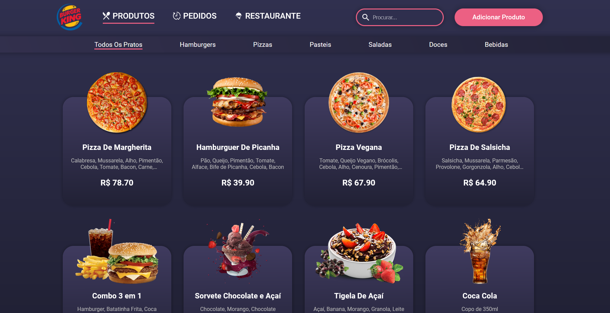
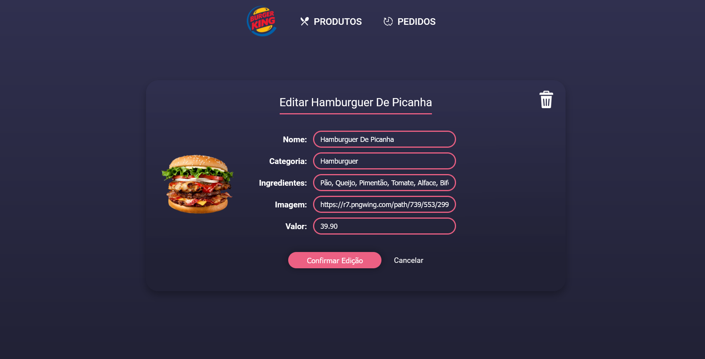

<body>
        <h1>Projeto Catálago</h1>
        <div>
                
                
        </div>
        <h2 style="margin-top:2rem">Descrição do Projeto</h2>
        <p>Este projeto foi desenvolvido com fins de aprendizagem no curso de programação Full Stack da Blue EdTech, com o foco de
        criar uma aplicação que execute todas as operações do CRUD e leve o usuário para as rotas criadas.<br>
        Na página Admin você pode adicionar os produtos, editar e excluir.<br>
        Na página principal do restaurante, funciona como um cardápio para o cliente, onde ele pode ver os produtos e clicar sobre cada um para saber os detalhes.
        </p>
        
## Como Clonar o Repositório

Para clonar este repositório, basta copiar o comando a baixo sem o <b>'$'</b>, ir até o terminal em seu computador, na pasta que deseja que o repositório seja clonado, colar o comando e apertar a tecla <b>Enter</b>.

```bash
$ git clone https://github.com/mlucasdev/projeto-catalago-restaurante.git
```

## Como Instalar

```bash
$ npm install
```

## Como Rodar a Aplicação

```bash
# development
$ npm run dev
```

## Como Testar a Aplicação

Após ter realizado os procedimentos a cima, cole o este link em seu navegador. <b>http://localhost:3002/admin</b>
        
## Stacks Usadas

Node.Js | JavaScript | HTML | EJS | CSS | Express | PostgreSQL | Sequelize

## Contato

- Autor - [Lucas Marques](https://www.linkedin.com/in/mlucasdev/)

        

</body>
